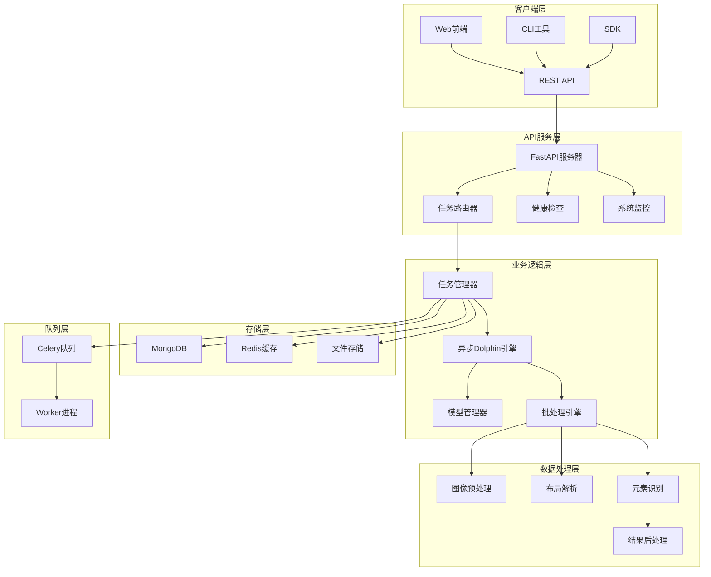

# xDAN SmartDoc Dolphin - 高性能并发异步智能文档识别系统

## 📋 项目架构概览

### 系统架构图



### 核心组件

#### 1. 异步Dolphin引擎 (`src/engines/async_dolphin.py`)
- **功能**: 高性能异步文档处理引擎
- **特性**:
  - 异步并发处理
  - GPU内存优化管理
  - 批处理支持
  - 模型预热和缓存
  - 错误恢复机制

#### 2. 配置管理 (`src/core/config.py`)
- **功能**: 统一配置管理
- **特性**:
  - 环境变量支持
  - 类型验证
  - 缓存配置
  - 多环境支持

#### 3. 数据模型 (`src/core/models.py`)
- **功能**: 数据结构定义
- **模型**:
  - `DocumentParseTask`: 文档解析任务
  - `DocumentElement`: 文档元素
  - `DocumentParseResult`: 解析结果

#### 4. 工具模块 (`src/utils/`)
- **图像处理** (`image_utils.py`): 图像预处理、坐标转换
- **解析工具** (`parsing_utils.py`): 布局解析、Markdown生成
- **文件工具** (`file_utils.py`): 文件验证、哈希计算

## 🚀 Step-by-Step 构建指南

### 第一步：环境准备

1. **创建uv环境**
```bash
# 使用uv创建项目环境
uv venv xdan-smartdoc-dolphin
source .venv/bin/activate  # Linux/Mac
# 或 .venv\Scripts\activate  # Windows

# 安装依赖
uv pip install -e .
```

2. **下载Dolphin模型**
```bash
# 方法1: 从Hugging Face下载
git lfs install
git clone https://huggingface.co/ByteDance/Dolphin ./hf_model

# 方法2: 使用huggingface-cli
huggingface-cli download ByteDance/Dolphin --local-dir ./hf_model
```

3. **配置环境变量**
```bash
# 创建.env文件
cat > .env << EOF
# 模型配置
MODEL_PATH=./hf_model
MODEL_DEVICE=cuda
MODEL_PRECISION=half
MAX_BATCH_SIZE=16

# 数据库配置
MONGODB_URL=mongodb://localhost:27017
REDIS_URL=redis://localhost:6379

# API配置
API_HOST=0.0.0.0
API_PORT=8000
DEBUG=true

# 日志配置
LOG_LEVEL=INFO
EOF
```

### 第二步：基础设施部署

1. **启动MongoDB**
```bash
# 使用Docker启动MongoDB
docker run -d \
  --name smartdoc-mongodb \
  -p 27017:27017 \
  -v mongodb_data:/data/db \
  mongo:latest
```

2. **启动Redis**
```bash
# 使用Docker启动Redis
docker run -d \
  --name smartdoc-redis \
  -p 6379:6379 \
  -v redis_data:/data \
  redis:latest redis-server --appendonly yes
```

### 第三步：核心服务开发

1. **完善异步引擎**
```python
# src/engines/async_dolphin.py 已创建
# 支持：
# - 异步模型加载
# - 批处理优化
# - GPU内存管理
# - 并发控制
```

2. **创建API服务器**
```python
# src/api/main.py
from fastapi import FastAPI
from src.core.config import settings
from src.core.logging import setup_logging

app = FastAPI(
    title="SmartDoc Dolphin API",
    version="1.0.0",
    description="高性能并发异步智能文档识别系统"
)

# 配置日志
setup_logging()

# 注册路由
from .routers import tasks, health, system
app.include_router(tasks.router, prefix="/api/v1/tasks", tags=["tasks"])
app.include_router(health.router, prefix="/api/v1/health", tags=["health"])
app.include_router(system.router, prefix="/api/v1/system", tags=["system"])
```

3. **实现任务管理**
```python
# src/api/routers/tasks.py
from fastapi import APIRouter, UploadFile, BackgroundTasks
from src.core.models import TaskCreateRequest, TaskResponse
from src.engines.async_dolphin import AsyncDolphinEngine

router = APIRouter()
engine = AsyncDolphinEngine()

@router.post("/", response_model=TaskResponse)
async def create_task(
    file: UploadFile,
    background_tasks: BackgroundTasks,
    request: TaskCreateRequest
):
    # 实现任务创建逻辑
    pass

@router.get("/{task_id}", response_model=TaskResponse)
async def get_task(task_id: str):
    # 实现任务查询逻辑
    pass
```

### 第四步：Worker进程开发

1. **创建Celery Worker**
```python
# src/worker/main.py
from celery import Celery
from src.core.config import settings
from src.engines.async_dolphin import AsyncDolphinEngine

app = Celery(
    'smartdoc-worker',
    broker=settings.celery_broker_url,
    backend=settings.celery_result_backend
)

@app.task
async def process_document_task(task_id: str, file_path: str):
    engine = AsyncDolphinEngine()
    # 实现文档处理逻辑
    pass
```

2. **实现数据库操作**
```python
# src/database/mongodb.py
from motor.motor_asyncio import AsyncIOMotorClient
from src.core.config import settings

class MongoDBManager:
    def __init__(self):
        self.client = AsyncIOMotorClient(settings.mongodb_url)
        self.db = self.client[settings.mongodb_database]
    
    async def save_task(self, task_data):
        # 实现任务保存逻辑
        pass
```

### 第五步：性能优化

1. **批处理优化**
```python
# 在AsyncDolphinEngine中实现
async def process_batch(self, images: List[Image.Image], max_batch_size: int = 16):
    # 批量处理图像
    # 优化GPU内存使用
    # 并行元素解析
    pass
```

2. **缓存策略**
```python
# src/cache/redis_cache.py
import aioredis
from src.core.config import settings

class RedisCache:
    def __init__(self):
        self.redis = aioredis.from_url(settings.redis_url)
    
    async def cache_result(self, key: str, result: dict, ttl: int = 3600):
        # 实现结果缓存
        pass
```

3. **监控和指标**
```python
# src/monitoring/metrics.py
from prometheus_client import Counter, Histogram, Gauge

# 定义指标
TASK_COUNTER = Counter('smartdoc_tasks_total', 'Total tasks processed')
PROCESSING_TIME = Histogram('smartdoc_processing_seconds', 'Processing time')
ACTIVE_TASKS = Gauge('smartdoc_active_tasks', 'Active tasks')
```

### 第六步：部署和运维

1. **Docker化部署**
```dockerfile
# Dockerfile
FROM python:3.10-slim

WORKDIR /app
COPY . .

RUN pip install uv
RUN uv pip install -e .

CMD ["uvicorn", "src.api.main:app", "--host", "0.0.0.0", "--port", "8000"]
```

2. **Docker Compose**
```yaml
# docker-compose.yml
version: '3.8'
services:
  api:
    build: .
    ports:
      - "8000:8000"
    environment:
      - MONGODB_URL=mongodb://mongodb:27017
      - REDIS_URL=redis://redis:6379
    depends_on:
      - mongodb
      - redis
  
  worker:
    build: .
    command: celery -A src.worker.main worker --loglevel=info
    depends_on:
      - mongodb
      - redis
  
  mongodb:
    image: mongo:latest
    volumes:
      - mongodb_data:/data/db
  
  redis:
    image: redis:latest
    volumes:
      - redis_data:/data

volumes:
  mongodb_data:
  redis_data:
```

## 🔧 关键技术特性

### 1. 高性能异步处理
- **异步I/O**: 使用asyncio处理并发请求
- **GPU优化**: 智能GPU内存管理和批处理
- **连接池**: 数据库和Redis连接池优化

### 2. 可扩展架构
- **微服务设计**: 模块化组件，易于扩展
- **队列系统**: Celery分布式任务队列
- **负载均衡**: 支持多实例部署

### 3. 监控和运维
- **结构化日志**: 使用structlog进行日志管理
- **指标监控**: Prometheus指标收集
- **健康检查**: 完整的健康检查机制

### 4. 安全性
- **输入验证**: Pydantic数据验证
- **文件安全**: 文件类型和大小限制
- **错误处理**: 完善的异常处理机制

## 📊 性能指标

### 预期性能
- **并发处理**: 支持100+并发请求
- **处理速度**: 单页文档<5秒
- **吞吐量**: 1000+文档/小时
- **内存使用**: <8GB GPU内存

### 优化策略
1. **模型优化**: 半精度推理，减少内存占用
2. **批处理**: 动态批大小调整
3. **缓存**: 多层缓存策略
4. **预热**: 模型预热减少冷启动时间

## 🛠️ 开发工具

### 代码质量
```bash
# 代码格式化
black src/
isort src/

# 类型检查
mypy src/

# 代码检查
ruff check src/
```

### 测试
```bash
# 运行测试
pytest tests/ -v

# 覆盖率测试
pytest --cov=src tests/
```

### 部署
```bash
# 启动开发服务器
uvicorn src.api.main:app --reload

# 启动Worker
celery -A src.worker.main worker --loglevel=info

# 启动监控
celery -A src.worker.main flower
```

这个架构提供了一个完整的、高性能的、可扩展的智能文档识别系统，基于xDAN 高性能多模态模型，支持异步并发处理，具备完善的监控和运维能力。 